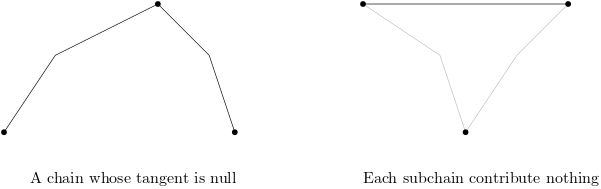

---

title: Optimal-Shortest-Path-in-Simple-Polygon
date: 2023-12-02 17:22:44
tags: ShortestPath
categories: 数据结构与算法
---

Let P be a simple polygon with n sides and this report will give a method to preprocess the polygon so that given two query points p and q inside P, the length of the shortest path inside the polygon from p to q can be found in time O(log n).

<!--more-->

### 1. Introduction

The algorithm's aim is to solve the Euclidean shortest path problem and focuses on a simple one: moving a point inside a simple polygon in the plane.

All the related algorithms are based on a triangulation of the polygon, the previous algorithms pre-select a fixed source point, so one of the points is fixed. When it comes to the situation neither endpoint of the path is predetermined, they will need linear time to find the shortest path. This new algorithm can find the shortest path between any two points. It needs **linear time to build** and **do the query to find the length in logarithmic time**. Also, it needs **time proportional to the number of turns to get the path itself. **

The idea is to go through some subpolygons, each of them containing information about the shortest paths inside it. When we query, we gather this information to find the shortest path from source to destination.

### 2. The balanced hierarchical decomposition of P

First, we need to split the main polygon P into subpolygons. There's a polygon cutting theorem as follows:

**any simple polygon of at least 4 vertices has a diagonal that divides it into two subpolygons with roughly equal size**

If we apply it recursively then we have a triangulation of P. Then we can use a binary tree S to denote the split, each layer stands for a split stage, root means the first split's diagonal, children of root s stands for the diagonals of these two subpolygons. These subpolygons are called **cell** and they are very important.

Some Notation:

* d: diagonal
* $P_d$: the diagonal d cuts $P_d$ into two cells
* S: binary split tree
* $L(d)$: depth of d in S, e.g. l(d1) = 0, l(d2) = 1.
* H(d): height of d in S, e.g. H(d2) = L(d7) - L(d2) = 2

Cells not associated with a diagonal are those small triangles after the split. They have a depth of 1 greater than the depth of its bounding diagonal. e.g. triangle IHG has a depth of 4.

In order to refer to diagonal pairs the shortest path passes through we need **the factor graph $S^*$**. It's defined as follows:
we get $S^*$ from S by adding edges connecting each d to all diagonals bounding $P_d$.  Following is $S^*$ from the previous tree.

edge of $S^*$ represents a pair of diagonals of the cell's bounding.	

**Lemma1: The size of the factor graph $S^*$ is $O(n)$ **

We can get S and $S^*$ in **O(nloglogn) + O(n)** time.

### 3. Shortest paths and the polygon decomposition

This section analyzes the sequence of diagonals crossed by the shortest path in P, which is the sequence of cells.

This sequence can be discovered quickly once we know the triangles containing the two endpoints. Then using the pre-computed information inside each adjacent pair of diagonals we can find the path.

To begin with, we have two points p and q in P which are starting point and ending point. Then the path from p to q crosses several diagonals, we call them **separating for p and q**. Following are some properties of separatings:

* To pass a separating the shortest path needs to pass all separatings on the side of q first.
* Adjacent separating have different depths
* Between two separatings with the same depth, there's one with lesser depth.

Then we need to define a subsequence of separatings. First we have **principal separating diagonal $\hat d$** which is the lowest common ancestor in S of all the separating diagonals, e.g.d2 is principal if p is in IHG and q is in AKF. Also we define the separating diagonals nearest p and q also to be principal diagonals and we call them $d_p $ and $d_q$ .

Then we have **$D_p$ to be a subsequence of the separating diagonals between $d_p$ and $\hat d$. ** e.g. d5 and d7 are two new principal diagonals. The **principal diagonals are then just those in $D_p$ together with those in $D_q$**.

> Scan through this sequence from $d_p$ to $\hat d$ and keep track of the minimum depth seen so far. 
>
> During the scan, discard all diagonals with depth greater than the current minimum. 
>
> The remaining diagonals are of strictly increasing depth (by the lacuna property) and form $D_p$. 
>
> The sequence $D_p$, is defined symmetrically, proceeding from $d_p$ to $\hat d$. The principal diagonals are then just those in $D_p$ together with those in $D_p$.
>
> make d2 to be $\hat d$ and d5 to be $d_p$ and d7 to be $d_q$.
>
> Then $D_p$ is d5-d2, $D_q$ is d7-d4-d2. 

**The calculation of $D_p$ can be done in log time**: we can scan in the tree S from $d_p$ to $\hat d$ and check all nodes(diagonals in P) and see if they are between $\hat d$ and $d_p$ in P(This can be done in constant time).If it's between then it belongs to $D_p$. 

**Conclusion**: We can get a sequence of separatings in O(logn) time and the "concatenation" of the shortest path from p to q lies in.

### 4. Hourglass and Shortest Paths

#### Introduction to Hourglass

We need to use an hourglass structure to represent the shortest paths between two diagonals.

Each hourglass is associated with an edge of the factor graph because an edge has two nodes( two separate diagonals) and can form an hourglass.

**funnel**: a funnel represents the shortest path from a source s to two endpoints of an edge or a diagonal. Let $p_1,p_2$ be two endpoints of a diagonal and s be the source, then from s to endpoints' shortest path have a shared edge, then at some point, they will separate. We call this point A **apex of the funnel**. Each of the funnel paths is *inward convex*.

New Notation:

* $\pi(p,q)$: the shortest path inside P that connects points p and q.
* Hourglass: let $\overline {AB}$ and $\overline {CD}$ be two diagonals of P and BACD is the subsequence of vertex, then the union of the two paths $\pi(A,C)$ and $\pi(B,D)$ is the *hourglass* of $\bar {AB}$ and $\bar {CD}$.
* String: If the paths share any vertices, then the hourglass is essentially two funnels joined by a polygonal path between their apexes. We call this shortest path between the apexes *string*.

If we know the path from s to a/p1/p2 then we can use the funnel to determine the length of $\pi(s,q)$ for every q on d. There's only one tangent v from q to the funnel, so we can use the path $\pi(s,a$) + (a,v) + tangent(v,q) as the shortest path $\pi(s,q)$.

As the funnel is from a fixed source, we need to get the shortest path from one diagonal to another diagonal, so we introduce a new structure hourglass. It's represented by two diagonals AB  and CD. The union of two paths $\pi(A,C)$ and $\pi(B,D)$ is the hourglass of AB and CD. If the paths share any vertices then it's a **closed hourglass**, or else there's a segment with one endpoint on AB and the other on CD that avoids the polygon, it's an **open hourglass**.

If we want to find the point's shortest path from AB to CD, if it's closed then it's just two funnels and one string. If it's open then there will be 2 cases:

1. p,q are visible: pq is the shortest path
2. p,q aren't visible, there will be 2 cases
   1. P,q are on one side with A, C: the shortest path is $ tangent(p, \pi(A,C) )+ $tangents in $\pi(A,C) + tangent(q,\pi(A,C))$ 
   2. p,q are far away: the shortest path is $tangent(p,\pi(A,C))+$ the portions of the hourglass chains needed to connect the tangents $+ tangent(q,\pi(B,C))$.

Hourglasss are very suitable for concat. However, there are several different cases:

1. Both hourglasses are closed: (d1,d2),(d2,d3),(d1,d3)are all closed, then the shortest path uses two funnels d1,d3 and old string augmenting shortest path $\pi(a,a')$.

   

2. One hourglass is closed and the other is open, we define the closed one is $(d_1,d_2)$ and the open one is $(d_2,d_3)$. Then we have a point a as the funnel of $d_2$. First, we find the apex a' in the funnel (a,$d_3$). Second, we get shortest path in funnel $(a,d_1)$. Third, we add the shortest path with $\pi(a,a')$ and get the final shortest path.

   

3. If both are open, then the four common tangents that touch one chain from each hourglass determine the result.

   
   

Now we can only find shortest paths from diagonals of hourglasses, but it's easy to extend to all points inside the hourglass. Suppose we have p and q which we want to find the shortest path then we can make tangents from p,q to the nearest diagonals $d_p$ and $d_q$. Or we can see p,q as two small diagonals, and we just contact them with $d_p,d_q$ and get 3 hourglasses, and they are a single closed hourglass and we can get the shortest path between p and q.

#### 4.1 Specifications and Use

This subsection shows a data structure that allows efficient representation and manipulation of hourglass. It also specifies the operation the structure must support and the allowable space and time complexities of each(operations). 

New Notation:

* $H(d_1,d_2)$ : the hourglass between $d_1$ and $d_2$.

##### Operation1: Concatenation

The concatenation is finding common tangents between pairs of convex polygonal chains or between points (degenerate convex chain). So we have the following requirements:

1. If the tangent from one point to the hourglass $H(d_1,d_2)$ and $H(d_2,d_3)$ can be found in $t_1,t_2$, then the common tangent of the two hourglasses can be found in time$O(t_1+t_2)$.
2. If the tangent from one point to the hourglass $H(d_1,d_2)$ and $H(d_2,d_3)$ can be found in $t_1,t_2$, then the hourglass $H(d_1,d_3)$ can be constructed in $O(t_1+t_2)$ time **and additional space**, and the original two hourglasses are unaltered by concatenation.

The following two requirements help the query operation and make it faster.

3. If the tangent from one point to the hourglass $H(d_1,d_2)$ and $H(d_2,d_3)$ can be found in $t_1,t_2$, then tangents to $H(d_1,d_3)$ can be found in time max$(t_1,t_2) + C$. For some constant C.
4. if tangents from a point to $H(d_1,d_2)$ can be found in time t, the length of the shortest path between d1 and d2 can be found in O(t) time.The path itself can be found in O(t+m) time and m is the number of turns in the path.

Then we can save some hourglasses and concat them to find the necessary hourglass to find the shortest path.

Previously we built a tree while doing triangulation and adding diagonals of depth k at time k(one layer at a time). Now we can **do it backwards**:

1. Delete a diagonal with the greatest depth in S
2. merge two adjacent cells of the diagonal and create a new cell
3. Construct an hourglass between the pair of diagonals.

After all diagonals are removed we **have hourglasses corresponding to all the edges in $S^*$**.

During this construction, there's an inductive invariant: before the diagonal of depth k is deleted, all hourglassed in cells with depth greater than k have been computed. The hourglasses built have special properties, and we can use them to prove the linear time and space bound. As the procedure combines hourglasses layer by layer, so the time is logarithmic(with a connection of the height of the triangulation tree), and the time could be linear(one by one following the chain). To express this log bound we need a new notion:

New Notation:

* $\lambda(d_1,d_2)$: if two diagonals $d_1$ and $d_2$ are linked in $S^*$ and they lie on the boundary of a cell, then $\lambda(d_1,d_2)$ is the log of the size of the cell.

**Lemma 2**: If $d_1$ and $d_2$ are linked by an edge in the factor graph, it's possible to find the tangents through a point to the hourglass $H(d_1,d_2)$ in time $O(\lambda(d_1,d_2))$.

Using this Lemma we are going to prove the linearity of the construction.

We can constructe one hourglass obtained by concatenating two hourglasses across diagonal d in time and space proportional to the logarithm of the size of $P_d$, and this quantity is proportional to h(d). The height is less than the height of two diagonals of the new hourglass, make one of the new diagonal to be d', there are O(h(d')) edges in $S^*$ joining d to lower diagonals, the hourglasses corresponding to these edges can be built in $O((h(d'))^2)$ time and space.

Overall the construction takes time and space proportional to O(n). After build these hourglasses they can answer shortest path queries in $O(log^2n)$ time:

Between p and q there are O(log n) hourglasses and we can concat them into a single long hourglass using O(log n) concatenations. From previous we know each concatenation takes O(log n) time so it's $O(log^2n)$  time. Finally, we can view p and q as diagonals and concatenate $H(p,d_p), H(d_p,d_q),H(d_q,q)$ to get H(p,q) in O(log n) additional time, this hourglass is a string and it's the shortest path from p to q. As it's a string we can get the length of the path, and the path itself can be extracted in additional time by the forth requirement.

#### 4.2 The Chain Data Structure

Convex polygonal chains are the basic constituents of hourglasses, it represents ordered convex chains by binary trees. We need to build hourglasss from chains, so chains need to satisfy some analogous conditions. A chain is the convex hull of its subchains.

First, each chain is a shortest path inside P, if the chain has endpoints A and B then the chain is $\pi(A,B)$. Then the chain is convex and cannot spiral. Also, the chain is equal to its own convex hull minus the segment $\bar {AB}$.

there are two types of the chain: a trivial chain and a derived chain.

Trivial chain: a single polygon edge

Derived chain: the convex hull of two subchains, each of them may contribute no edges to the shortest path.

the derived chain contains the outer common tangent of two subchains, and sometimes there are no tangents. A tangent edge may consist of a single point,  we need to ensure there are not too many null edges in any chain. If a null edge in $\pi(A, B)$ or $\pi(B, C)$ coincides with one endpoint of the outer common tangent of $\pi(A, B)$ and $\pi(B, C)$, we do not include the null edge in the derived chain $\pi(A, C)$. As a result, no chain contains adjacent null edges. This is illustrated in the following figure. Here at vertex D, there's a null edge from $\pi(A, B)$ and also one from $\pi(B,C)$. After concatenation, these two null edges no longer exist in the new chain $\pi(A,C)$.

Also, no chain should have adjacent collinear edges, if a common tangent is collinear with an edge then we can extend the tangent edge to delete the collinear dege.

The chain supports two important operations: tangent-finding and constructing a chain from its subchains. **The chain data structure can be denoted with a binary tree: you can use a leaf node to represent a trivial chain, and use a node that contains the common tangent of the subchains and pointers to the nodes to represent a derived chain.** So we can build the tree based on a chain like in the next figure.

To do the tangent-finding, first, we are given a chain $\pi(A,C)$ and a point X outside the convex hull. **The task is to find the two tangents from X to the chain.** We can look at the edge stored in node v which represents $\pi(A,C)$ to find each tangent,  and then in constant time, we can determine which subchain the tangent touches, and then find the tangent by recursively searching in the subchain's tree. **This search takes time proportional to the height of the tree v.**

Another query is to find the inner and outer common tangents of two chains. neither chain is contained in the convex hull of the other. Using the techniques of Overmars and van Leeuwen,**the tangents can be found in time proportional to the sum of the heights of the trees represent $\pi(A,B)$ $\pi(C,D)$**.

When we use chain data structure in hourglass we only need to compute one tangent at a time, so we need to modify the tangent-finding algorithm a bit for that. We need to specify which tangent we want because there are two tangents for one chain. We can define left and right for each chain by taking the convex side to be up.

We have two chain conditions analogueue to the hourglass condition:

C1: If the lines passing through a given query point and tangent to chains $\pi(A, B)$ and $\pi(C, D)$ can be found in times $t_1$, and $t_2$, the common tangents of the two chains can be found in time O(t1+t2).

To illustrate this condition a bit more clear, we can refer to the following figure. Given the assumtion the two tangents from a query point to two chains can be found in $t_1$ and $t_2$, we know in any 1 call we can find two tangents in $t_1 + t_2$ time. In most of the time these two tangents are not common tangents like green lines in the figure, but after O(1) calls we can find a situation where the two tangents are common tangents like the red lines in the figure. So we can find the common tangents in time $O(t_1 + t_2)$.

C3:Suppose chain $\pi(A, C)$ is built from subchains $\pi(A, B)$ and $\pi(B, C)$. If tangents from a point to chains $\pi(A, B)$ and$\pi(B, C)$ can be found in times t1 and t2, tangents to their combined chain $\pi(A, C)$ can be found in time max(t1,t2) + <constant>.

Also, condition 4 requires computing the length of the path in hourglasses, so we need to store chain lengths in the chain data structure. Consider the following figure, in this chain the node representing $\pi(A,E)$ stores the length of AB,BD and DE. The sum of these lengths is the length of AE.

new notations:

If node v represents the chain of fig 9.

* v.tan : the tangent edge BD
* v.llen: length of  $\pi(A,B)$
* v.rlen: length of  $\pi(C,E)$
* v.tlen: length of BD
* v.len: length of $\pi(A,E)$ and it's the sum of llen, rlen and tlen. If v is just a single edge, then llen = rlen = 0. Len = tlen

The following lemma helps us fill in the length fields of v:

**lemma3:** Let v be the root of the tree representing the chain $\pi(A, E)$ of Fig. 9. Let u be a node in the tree whose edge u. tan appears in $\pi(A, E)$, and let X be the right endpoint of u. tan. The length of the chain $\pi(A, X)$ can be determined by looking at the lengths stored at the nodes along the path from v to u in the tree.

*Proof.* The proof is based on classification discussion and keep in mind that each node saves len, llen, rlen and tlen.

If u = v, then u.tan = $\overline{BD}$. The length of $\pi(A,X)$ is just v.llen + u.tlen.

 If u is in the left subtree of v, then only edges from the subchain $\pi(A,B)$ contribute to $\pi(A,X)$. By induction we can find the length of $\pi(A,X)$ by looking at the lengths stored along the path from the left child of v down to u. In this example from v to u we can get node $t_2$, and the length of $\pi(A,X)$ is $t_2.llen + t_2.tlen + u.len$.

If u is in the right subtree of v, then $\pi(A,X)$ consists of $\pi(A,B),\overline{BD}$ and some prefix of $\pi(D,E)$. Thus the length of $\pi(A,X)$  is v.llen + v.tlen + the length of $\pi(D,X)$. This last term is the same as the length of $\pi(C,X)$ - the length of $\pi(C,D)$. If t is the right child of v, the node associated with $\pi(C,E)$, then the length of $\pi(A,X)$ is v.len - t.len + the length of $\pi(C,X)$. By induction we can find the length of $\pi(C,X)$ by looking at the nodes on the path from t to u.

To fill in the length fields of v we need to compute v.llen and v.rlen. Using lemma3 we can know that we can get v.llen by looking at the nodes along the path from a point u in the tree representing the left subchain up to the root of the left subtree. this can be computed in time proportional to the height of v. Also we can find v.rlen in a similar manner. This completes our discussion of the length fields.

We still need to satisfy another requirement which is "given a chain data structure, we must be able to retrieve the edges of the chain in the constant time". It's very hard to retrieve the edges because the data structure won't modify the corresponding structure of the left and right subchains, so we don't know the sequence of a path as we are getting them from mid to each side.

Our solution uses a compact representation of the differences between the chain and its left and right subchains. To be more specific, consider the node v that represents the chain before. Node v has two lists associated with it, a left and a right *edge retrieval list*. Each record r in a retrieval list has two pointers, one to a node in the left/right subtree and one to a record in another retrieval list, called the *partner* of r. So we define record as $record := (node pointer,partnerpointer)$. The right retrieval list is analogous to the left retrieval list.

First we need to explain what's the node pointers.  Let w be the left child of v, and let u be the node in the subtree rooted at w whose edge u.tan appears in $\pi(A,E)$ and is incident to B. The records in v's left retrieval list point to the nodes on the path from w to u, inclusive, whose associated edges belong to $\pi(A,E)$. The retrieval list keeps the nodes in the same order as the path from w to u. This is the node pointers of the left retrieval list and the right retrieval list are defined analogously. I'll explain it in detail.

We will start with left retrieval list, from the figure we can get the left retrieval list as [(w,-),(x,-),(u,-)].

Also there's right retrieval list as[(w,-),(y,-),(u,-)].

Then there are some lemma shows some feature of retrieval lists, and they will also enable us to specify the *partner* fields of list records.

**Lemma 4** Let s and t be two nodes pointed to by consecutive records in the left retrieval list of v. Then these two nodes are in an ancestor/descendant relationship. If s is the ancestor, then t is in the right subtree of s, and some record in the right retrieval list of s points to t. Analogous claims hold for records in the right retrieval list of v.

Now we can specify the *partner* fields of retrieval list records. Each record has its own field, the first record's field is null. Let r and $r\prime $ be two consecutive records in v's left retrieval list that point to nodes s and t, and s is an ancestor of t.  Then the *partner* field of $r\prime$ points to the record in the right retrieval list of s that points to t. The partner fields of records in the right retrieval list are defined analogously.

With the previous example we can update the two lists as: left retrieval list[]

Then the following two lemmas show we can get the edges of a chain with the edge retrieval lists in constant time apiece.

**Lemma5** Let r be a record in the left retrieval list of v, and let s be the node it points to. Using the part of the retrieval list r heads, we can retrieve all the edges of v’s chain strictly between s.tan and v.tan in left-to-right order and in constant time per edge. A similar claim holds for right retrieval lists.

**Lemma6** Using v’s left edge retrieval list, we can report all the edges of v’s chain that are to the left of v. tan. We produce the edges in left-to-right order and at constant cost per edge. A similar claim holds for v’s right retrieval list.

Using the retrieval list we can get the edges of a chain in constant time apiece. Also we found the list of a node v is bounded by the height of v, and we will show there's another way to get the retrieval list efficiently.

Let u be the node in v’s left subtree such that u.tan is adjacent to v.tan in v’s chain. The left retrieval list of v points to nodes on the path from v to u. To construct the retrieval list, we must be able to tell which nodes on the path have edges in v’s chain. Our approach is based on comparing pairs of diagonals or polygon edges using the hiding test described below: Let t be a node in the tree rooted at v. If t.tan does not appear in v's chain, there's some edge $\overline{ab}$ in v's chain such that t.tan is contained in the pocket defined by $\overline{ab}$  and the polygon boundary between a and b. We say that $\overline{ab}$ hides t.tan.

We can test whether one edge hides another by comparing the indices of their endpoints, assuming all the endpoints are polygon vertices.Suppose that the edge connecting vertices i and l belongs to v’s chain, and i is left of l on the chain. 

* If i < l, the polygon vertices are numbered consecutively along the boundary of the pocket cut off by $\overline{il}$. In this case, an edge $\overline{jk}$ is hidden by $\overline{il}$ if and only if $\overline{jk} \neq \overline{il}$ and both integers j and k lie in the interval [i,l].
* If i > l, an edge $\overline{jk}$ is hidden by $\overline{il}$ if and only if $\overline{jk} \neq \overline{il}$ and both j and k are outside the interval [l+1,i-1].

However, when we are doing query, not all chain vertics are polygon vertices, some times query points p and q appear in some chains and they are not polygon vertices, so we must assign them vertex numbers before using the hiding test. Suppose that source point p lies in triangle $ \triangle{ijk} $ and that $d_p$ is diagonsl $\overline{ik}$.

We constract the hourglass from p to q by pretending p is a polygon vertex, we assign to p the vertex number j. Then it gives a consistent counterclockwise numbering to the vertices of the unshaded subpolygon and allow us to test hiding as described above.

The following lemma shows how to use the hiding test to construct retrieval lists.

Lemma 7. Let u be the node in the left subtree of v such that u. tan is adjacent to v. tan in v’s chain, and let t be a descendant of v on the path from v to u. Let s be the lowest proper ancestor of t such that s. tan appears in v’s chain. Either t. tan is hidden by s. tan or by v. tan, or it appears in v’s chain.

Using this lemma to determine which nodes on the path from v to u have edges in v's chain, we can go from v to u and test each one. Suppose t is the current node and s is its lowest proper ancestor such that s.tan appears in v's chain. If t.tan is not hidden by s.tan or v.tan, then it appears in v's chain. 

Until now we have all the elements of the chain data structure:

1. A chain is represented by the root node of a binary tree. 
2. Each node has two edge retrieval lists to help report the edges of the chain. With retrieval lists, each node uses storage proportional to the height of the tree.
3. We can construct a chain's tree from its subchain's trees in time proportional to the height of the new tree, which is proportional to the sum of the heights of the subtrees.
4. The new chain's data structure does not modify any of the old chain's data structures.

With these facts, we can establish the following analogue requirements:

(C2) If tangents from a point to chains $\pi(A, B)$ and $\pi(B, C)$ can be found in times t1 and t2, the data structure for the combined chain $\pi(A, C)$ can be built in O(t1 + t2) time and additional space. Furthermore, the data structures for the original two chains are unaltered by the construction.

(C4) The length of a chain can be found in constant time. The edge sequence of the chain can be extracted in constant time per edge.

#### String data structure

This subsection uses the chains of the preceding subsection to implement the hourglass data structure. As the hourglass data structure satisfies the requirements enunciated at the beginning of this section, it can be used to answer shortest-path queries efficiently. The hourglass data structure contains two main components chains and strings. In the preceding subsection we described the chain data structure, and this subsection we begin with a discussion of strings.

If we were concerned only with the lengths of shortest paths and not with the paths themselves, we could represent strings by their lengths alone. However, we need additional structures to represent the edges of a string. As there are two types of strings, fundamental and derived, we need two types of representation. Fundamental strings are formed when the concatenation of two hourglasses collapses the multiple paths represented by funnels or open hourglasses into a single path. The following figure are some examples of fundamental strings.

A derived string is produced when a choled hourglass is concatenated with another hourglass. The following figure is an example of derived string.

The chains that appear in strings are obtained by truncating hourglass chains. We can represent truncated chains using the previous data structure. To clip off the right end of a chain, we simply create a new chain in which the old chain is the left subchain, the right subchain is null, and the tangent edge is the new chain's right endpoint. As discussed before, we cannot put one null edge next to another, so any chain has at most one more null edge than it has non-null edges.

From the definition we know a derived string when fully expanded is a sequence of fundamental strings. The data structure for a derived string is represented by an internal node whose children are its constituent strings. The tree has two or three children per node. We construct the derived string trees so that the non-empty fundamental strings that make up a derived string can be extracted in constant time. When concatenation would cause us to include an empty string in a derived string, we drop that string. We also rule out nodes in the tree representation of derived strings that have only one child.

So, when two hourglasses are concatenated and the resulting string is just the string belonging to one of the two, we set the new hourglass to point to the old string, rather than creating a new derived string node with only one child. This strategy means that the internal nodes of a derived string tree have at least two children. 

Traversing the tree takes time proportional to the number of leaves which is non-empty fundamental strings. Since the edges of each fundamental string can be extracted in constant time per edge, the edges of any string can be extracted within thesame time bound. This concludes our discussion of the string data structure.

#### hourglass data structure: Implementation

With these given data structure we can build our hourglass now. An hourglass is built of at most four convex chains and one string. The hourglass data structure has pointers to these live components. If any of the parts is missing, as when the hourglass is open, the corresponding pointer is null. To concatenate two hourglasses, we find the relevant common tangents of their chains, build the appropriate chains and strings, and set the pointer fields of a new hourglass structure. Each new chain is either an old chain or a convex hull of two old chains, possibly with an end clipped off as described above. The new string, if any, is either a fundamental string or a derived string that points to one new fundamental string and one or two old strings.

We can conclude from the preceding discussion that the hourglass data structure meets its specification. Each hourglass and string record uses a constant number of chains, and each concatenation requires a constant number of chain operations. Because chains satisfy conditions (Cl)-(C4), the hourglasses built from them satisfy requirements (l)-(4).

### 5. Improved Query Time bounds

From discussion above we can do shortest path queries in $O(log^2 n)$ time bound. This section shos how to reduce that to O(log n) time. 

We can observe that if many shortest path queries are answered, hourglasses corresponding to edges high up in the factor graph are used many times; furthermore, the cost of concatenating them is the major contribution to query time. If we could find a way to bypass most of the computation high up in $S^*$ then we can reduce the query cost.

To find the shortest path from p to q there are four main steps: 

1. Locate the points in the triangulation
2. find the subsequences $D_p$ and $D_q$ of the separating diagonals
3. find the hourglass between $d_p$ and $d_q$
4. Concatenate $H(p,d_P)$ and $H(d_q,q)$ with $H(d_p,d_q)$. 

In these steps only step 3 takes more than logarithmic time. To speed up step 3 we can precompute some intermediate results it uses. As the decomposition tree S is balanced, there are only $O(n/log^2n)$ nodes in S with at least $alog^2n $ descendants. Here a is a parameter that can be adjusted to increase the amont of preprocessing to decrease the query time. Let the set of these upper nodes to be U and then modify the factor graph $S^*$ by adding some edges which connects U with their ancestors. Each node of U has O((log n) ancestors, so the modification adds O(n/log n)edges to $S^*$. 

The hourglasses corresponding to the additional edges can be computed in O(log n) time apiece as the data structures representing them have log height.(Each node d in U must be linked to all its ancestors in S. Linking to the ancestors in order along the path from d to the root of S gives the claimed bounds.)And overall the additional hourglasses take linear time and space to construct.

These additional hourglasses provide the necessary bypass sructures to make $O(log^2 n)$ into O(log n) time. Let p and q be the query points. In log time we can find the subsequences $D_p$ and $D_q$ of the separating diagonals. The diagonal $\hat d$ is the lowest common ancestor in S of $d_p$ and $d_q$. If $\hat d$ is not in U, then the cells between $d_p$ and $d_q$ have $O(log^2 n)$ edges altogether as they are contained in $P_{\hat d}$. There are only $O(log(log^2 n))$ hourglasses need to be concatenated in order to produce $H(d_p,d_q)$, and each concatenation takes O(loglogn) time, so step 3 takes $O((loglog n)^2)$ time, which is dominated by the time of the other steps.

If $\hat d$ is in U let $d_p^-$  be the highest diagonal in D that is not in U, and let $d_p^+$ be the next higher diagonal in $D_p$ (the successor of $d_p^-$ in $D_p$). Define $d_q^-$ and $d_q^+$ similarly as the following figure shows.

As discussed before, when $\hat d \notin U$ we can find $H(d_p,d_p^-)$ and  $H(d_q^-,d_q)$ in $O((loglogn)^2)$ time. The hourglasses  $H(d_p^-,d_p^+)$ and $H(d_q^-,d_q^+)$ correspond to edges of $S^*$ and been precomputed. Since $\hat d$ is an ancestor in S of $d_p^+$ and $d_q^+$, and all three diagonals are in U, so the hourglasses $H(d_P^+,\hat d)$ and $H(\hat d,d_q^+$)also already exist, so we can just concate these six hourglasses and get $H(d_p,d_q)$ in logarithmic time, so the length from p to q can be found in O(log n) time.

We have the final theorem as follows:

THEOREM 1. There is a linear space data structure for storing a simple polygon P of size n so that given any two points inside P, the length of the shortest path joining them can be computed in O(log n) time. The actual path can be extracted in additional time proportional to the number of turns along it. Furthermore, this shortest path query structure for P can be computed in linear time once a triangulation of P is available.

