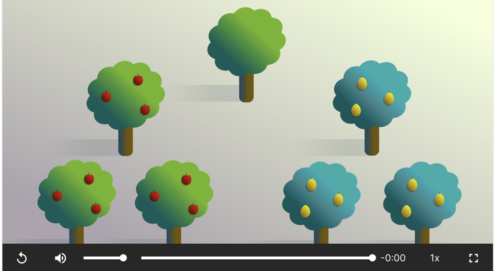

Unity learning note

<!--more-->

# Basic

按option可以调整观察视角，按qwer可以切换当前工具

先选中camera后按cmd+shift+f可以让camera自动调整到当前画面

选中某个元素后按f可以focus这个元素

## 设置Terrain快捷键

按住Shift可以lower terrain，使用[]可以调整画笔大小

## Start and update

start是运行脚本的时候只执行一次，而update是每一帧都执行一次

```c#
transform.Translate(x,y,z)会给物品位置加一个增量
```

## Variables

和c++类似

## Using SerializeField

新建material可以给物品添加材质

在变量前加`[SerializeField]`就可以让他在物品的inspector里手动设置

## Input.GetAxis

从菜单栏的Edit-project settings里可以看到所有用户输入所对应的键位。

在代码中使用`Input.GetAxis("Horizontal");`可以获得用户输入

## Time DeltaTime

为了让游戏在不同性能的电脑上效果一样就需要使用`Time.deltaTime`,然后乘一个movespeed就可以

## Cinemachine

1. 安装cinemachine包
2. 给主摄像机的components添加cinemachine brain component
3. 添加一个虚拟摄像机Virtual camera
4. 在这个虚拟摄像机的设置中把body设置成framing transposer,在上边的follow里选择跟踪某个物体
5. 在下边的body里有一个camera distance可以设置摄像机的远近

## Basic collision

每个物体都可以设置box collider， 可以和物体大小一样也可以大小不同来实现不一样的效果。

给玩家添加rigidbody component之后他就有了物理属性，可以碰撞。通过添加constrain可以控制旋转等

给墙体附加一个c#脚本，脚本里写一个OnCollisionEnter函数可以检测碰撞消息。

使用`        GetComponent<MeshRenderer>().material.color = Color.red;`可以在碰撞的时候变颜色

## Time

Time.time是当前的游戏时间

Time.Delta time是从上一帧开始经过的时间量。

## Tag

在右侧inspector里可以定义某个element的tag

代码中使用以下代码可以获得tag值

```c#
private void OnCollisionEnter(Collision other) {
        Color currentColor = GetComponent<MeshRenderer>().material.color;
        if (other.gameObject.tag == "Player")
        {
            ChangeColor(currentColor);
        }
 }
```

## Spin

通过transform.rotate(x,y,z)可以让物体在三个方向上旋转

# Boost course

## AddRelativeForce

使用rigidbody的addrelativeforce可以给他添加坐标轴方向的力，参数可以用(1,1,1)或者Vector3.up等同于(0,1,0)

## 实现帧速率independent

在做变化的时候乘一个变量再乘Time.deltaTime

```c#
rigidbody.AddRelativeForce(Vector3.up * thrustspeed * Time.deltaTime);

```

## 调整世界重力

在edit-》project settings-》 physics里调

## 添加drag

drag是rigidbody移动时影响对象的空气阻力大小

## unity audio system

需要三个东西，audio listener，audio source和audio file。

audio listenser一般附加在main camera上

audio source是产生声音的部件

打开loop可以循环播放

 如果没有声音可以去project setting里看audio的设置

## switch语句

```c#
switch()
{
  case a:
    a();
    break;
  default:
    d();
    break;
}
```

## 监测物体碰撞

写一个函数，输入一个Collision类型的变量other，然后就可以获得这个碰撞的一些信息

* Other.gameObject.tag是这个碰撞的对方物体的tag的string
* 

## 切换Scene

添加scene：File -> Build Settings-> add open scenes

代码中需要使用SceneManager类,导入的是UnityEngine.SceneManagement命名空间

获取当前Scene的index：

```csharp
SceneManager.GetActiveScene().buildIndex
```

切换Scene：

```csharp
SceneManager.LoadScene()
```

## 延迟函数生效

使用invoke("methodname", delayInSeconds)


# Unity Essentials

## Apply texture image on a material

点Albedo左边的小圆圈可以选择当前导入的各种材质图片

## Physic material

应用后可以让物体拥有弹性，新建Physic material后修改Bounciness参数可以添加弹性。这个材质会应用在物体的 Collider属性上。

## Prefab Variant

修改一个prefab的个体后拖进prefab文件夹他会提示你是否创建新的prefab variant， 这是大prefab的一个小分支。修改他会修改所有这个variant控制的instance，但是不会修改其他root控制的




## Assets

从https://assetstore.unity.com/zh?category=3d&orderBy=4&page=3&reverse=true可以获得现有的资源

然后在window-》package manager可以下载导入

## 3D音效

要实现根据人的位置所改变的音效需要调整音效的Spatial Blend到1，还需要设置一个Audio listener在主角身上

## 2D中z轴是z-index

## 2D实现球下落到平面上

给球添加rigidbody让他有重力可以下落，然后为了让球落到平面上停止需要给球和平面各添加对应的2D collider。

## 发布游戏到unity play

切记要安装WebGL Publisher Package！！


# Project1 Player Control

## Rigidbody 与 Collider

Rigidbody是用于实现物理模拟的组件，它可以附加到对象上以获得物理引擎控制，并且获得一些属性例如重力

Collider是用于定义游戏对象的物理形状来进行碰撞检测，它只用于定义边界

## Camera Follow Player

给camera写一个脚本，定义一个player变量，然后让camera的坐标等于player的坐标加一个offset即可

## LateUpdate

他会在Update执行之后执行，从而确保执行顺序是Update-LateUpdate-Update

## 获得用户输入

从edit-project settings里找到inputs

代码里新定义一个float类型变量x，获取方法是`x = Input.GetAxis("inputs里的名称")`

要获得按下某个键就用Input.GetKeyDown(KeyCode.Space))

## 移动player

`transform.Translate(Vector3.right * horizontalInput * Time.deltaTime * speed)`

或者使用transform.position = new Vector3(24,0,0)直接重定位目标

使用transform.position.x获得位置信息

## 从prefab中生成新object

使用instantiate方法可以以一个prefab作为模板生成新的object

` Instantiate(projectilePrefab, transform.position, projectilePrefab.transform.rotation);`

```csharp
public GameObject enemyPrefab;

Instantiate(enemyPrefab, new Vector3(0, 0, 6), enemyPrefab.transform.rotation);
```


## 删除object

直接使用`Destroy(gameObject)`删除

## 生成随机数

有两种，range和randomRange

range里写整数是左闭右开，写浮点数是左右都闭的。

`int position = Random.Range(-20,20)`

## 定时执行任务

使用InvokeRepeating可以定时执行函数，这个要写到start里


# Project2

## 获得物体的component（如rigidbody）

使用`GetComponent<Rigidbody>()`方法赋值给某个变量

## 使用addforce给物体施加外力（让他跳起来）

addforce接收两个参数，第一个是施加的力的矢量，即力的大小和方向。

mode: 表示施加力的模式，它是一个枚举类型，包括以下选项：

- `Force`: 施加一个持续的力，会根据刚体的质量产生加速度。
- `Impulse`: 施加一个瞬间的冲量，类似于一次性的力。
- `VelocityChange`: 直接改变刚体的速度，而不考虑质量。
- `Acceleration`: 施加一个持续的加速度，会受到质量的影响。

## 防止左脚踩右脚：

设置一个bool变量，当起跳的时候设置成false，当检测到碰撞的时候变成true。

## 背景循环使用

先设置一个起始坐标，在start里让他等于现在的位置，然后如果背景往左走了x，就让他归位。

让他更加连贯可以设置当背景往左走x/2的时候归位。

## 碰撞到障碍物后停止

首先需要给地面和障碍物加tag，然后在玩家运动脚本中使用

```c#
if (collision.gameObject.CompareTag("Obstacle")){
  gameOver = true;
}
```

在需要停止的运动脚本中定义一个`private PlayerController playerScript`变量，在start里给他用`GameObject.Find("Player").GetComponent<PlayerController>()`赋值为脚本，然后就可以直接调用这个脚本里的gameOver变量了。

## 编辑动画效果

首先在animation component中双击controller可以进入动画效果编辑界面，每个状态都对应一个动画效果，并且状态间还可以互相切换。

跳跃动作可以使用`SetTrigger("Jump_trig")`来触发。

## 添加粒子特效

首先把粒子效果添加进player作为子元素，然后在player脚本中新建粒子特效变量`public ParticleSystem explosionParticle`.

在需要效果的地方使用`explosionParticle.Play()`

## 添加音效

# Project 4

## 让摄像机聚焦到一点

设置一个空object，让相机成为这个object的子元素，这样旋转或者移动object可以调整相机

## 设置player向某个object方向前进

获取到物体之后使用`focalpoint.transform.forward`获得focalpoint的前方向

## 使用Physics Material

物理材质可以调整物体的摩擦力和弹性，apply后会在colider的material中出现

## 使用coroutine来设置独立沙漏

```csharp
StartCoroutine(PowerupCountdown());
IEnumerator PowerupCountdown()
    {
        yield return new WaitForSeconds(7);
        powered = false;
    }
```

# Project 5

## 设置鼠标点击效果

用OnMouseDown()检测鼠标点击到Collider就会触发

同样还有一些其他函数检测其他鼠标操作

## 让物体旋转

使用AddTorque可以让物体旋转，传入四个参数，xyz和这个力触发的方式。

`        targetRb.AddTorque(RandomTorque(), RandomTorque(), RandomTorque(), ForceMode.Impulse);`

## 添加界面上的文字

添加一个TextMeshPro，可以调整中心点。

要想修改文字内容，需要先声明一个TextMeshProUGUI类型变量，然后在需要改的地方使用ScoreText.text = ""就可以修改。

## 调用另一个文件中的函数

首先两个文件都需要应用于object上，被调用的脚本所在物体需要有一个tag，然后在调用的那个脚本中声明变量，找到被调脚本，然后调用函数。

``` csharp
    private Manager m;
    m = GameObject.FindGameObjectWithTag("Manager").GetComponent<Manager>();
		m.updateScore(-5);
```

## 添加按钮

在UI-button里添加

要想给他添加效果可以在inspactor里有一个onclick list，添加一个object作为新项，然后在右边的function里选想触发的函数。

要想在代码里定义这个变量就需要先使用UnityEngine.UI命名空间，然后再定义变量。

## 重新加载当前Scene

使用`        SceneManager.LoadScene(SceneManager.GetActiveScene().name);`

# OOP

在C#中，有多种访问修饰符，用于控制类的成员（字段、方法、属性等）的访问权限。以下是C#中常用的访问修饰符：

1. **public（公共）**：这是最开放的访问修饰符，允许成员在任何地方都可以访问，包括类的外部。

2. **private（私有）**：私有成员只能在声明它们的类的内部访问。这用于隐藏类的内部实现细节。

3. **protected（受保护）**：受保护成员可以在声明它们的类以及派生类中访问，但不能在类的外部访问。

4. **internal（内部）**：内部成员可以在同一个程序集（assembly）中的任何类中访问，但不能在程序集之外的类中访问。

5. **protected internal（受保护的内部）**：这是protected和internal的组合，允许在同一程序集中的类和派生类中访问。

6. **private protected（私有受保护）**：这是C# 7.2引入的，表示成员可以在同一程序集中的派生类中访问，但不能在程序集之外的类中访问。

使用 [SerializeField]可以让private类型的变量在inspector中被修改。

可以单独给某一个public变量设置权限，如：

```
public static MainManager Instance { get; } // add getter to the end of the line
```

这样就会设置严格的read-only，所以还需要加一个private set;

还可以在这里设置getter和setter validation来对变量取值进行限制，如：

```
set
{
    if (value < 0.0f)
        {
            Debug.LogError("You can't set a negative production speed!");
        }
        else
        {
            m_ProductionSpeed = value; // original setter now in if/else statement
        }
    }
}
```

# DADIU Notes

## Attributes

使用attributes可以自定义inspector

```csharp
using System.Collections;
using System.Collections.Generic;
using UnityEngine;

public class NewBehaviourScript : MonoBehaviour
{
    [Header("q")]
    public string cubeName;
    [Range(0, 10)]
    public float asas;
    [Min(2.0f)]
    public float ssss;
    [Space(10)]//Add space in inspector
    [Min(2.0f)]//This var's min value will be 2.0f
    public float sssss;
    public test2 cubeClassTest;
}

[System.Serializable]
public class test2
{
    [Header("w")]
    public string string1;
    [Range(0, 10)]
    public float asas;

}

```


