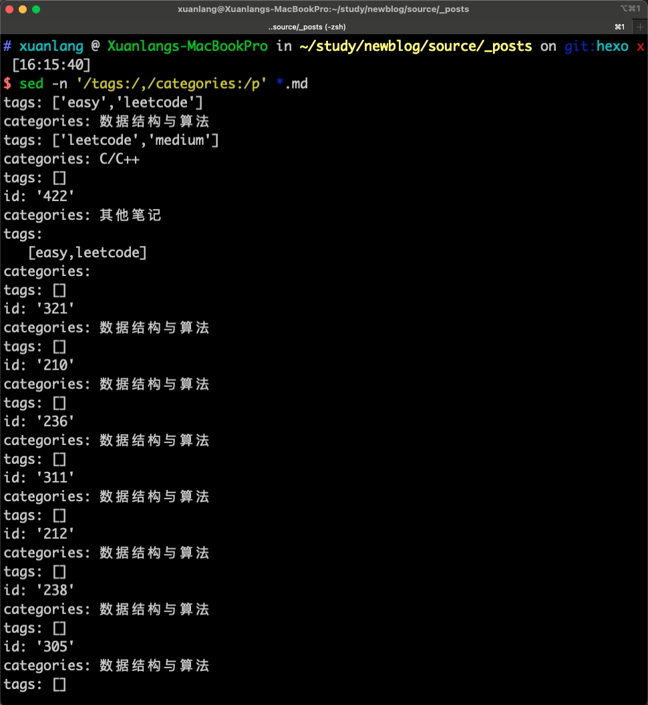
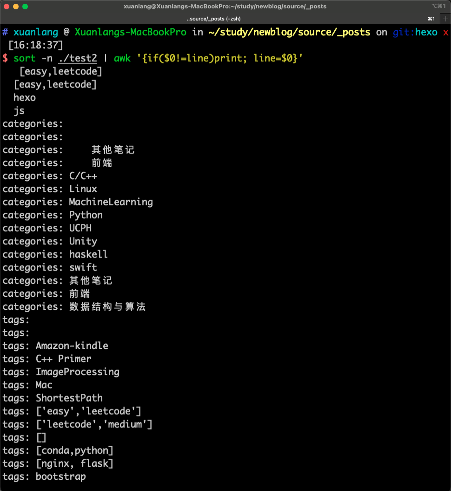
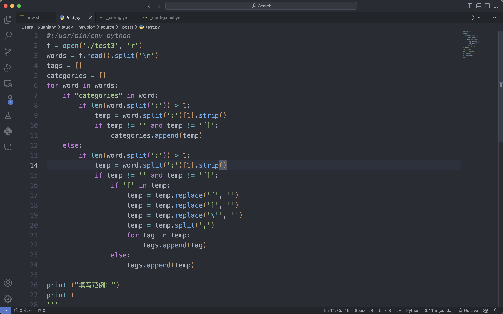
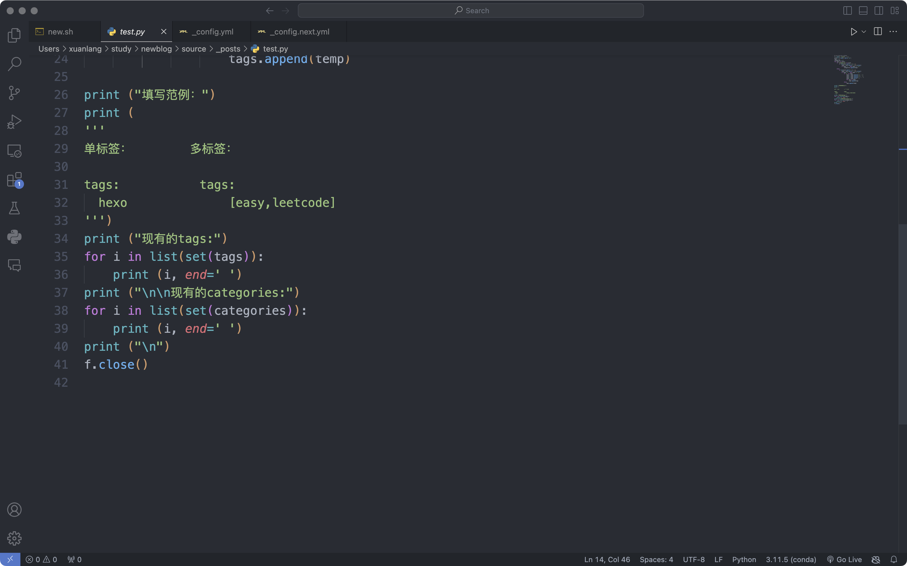
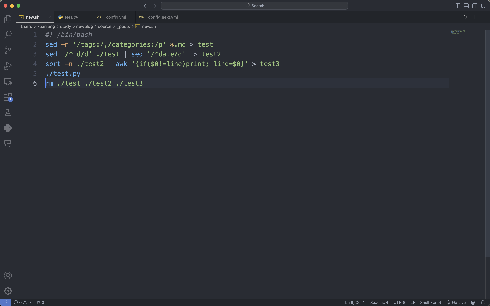
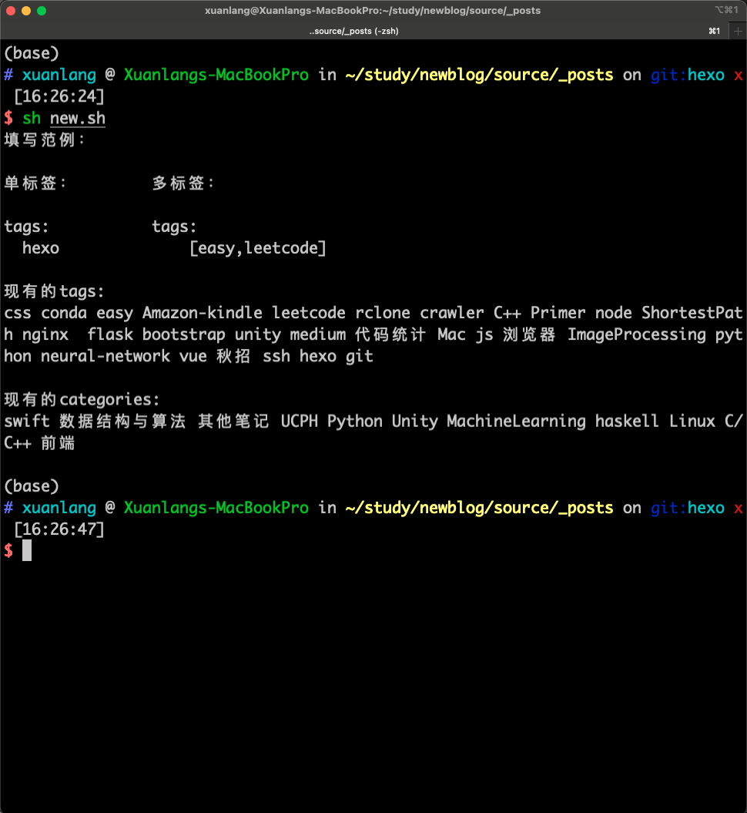

在新建hexo文章的时候需要先进入hexo的目录再新建，而且新建的文章常常不知道该给他加什么标签和分类，还得去网站上看现在有啥。这篇文章介绍了快速新建文章并且显示辅助信息的一系列操作。

<!--more-->

# 显示当前有的标签和分类

首先需要获取到所有的信息，由于hexo文章结构都是固定的，因此获得信息页不是很难。

首先使用



获取到tags和categories之间的文本并且保存在test文件中。[1]



在观察这个文件的时候我发现里边有很多不需要的内容，所以又使用了



来删除以id和date开头的行并保存在test2中。[2]



之后再使用`sort -n ./test2 | awk '{if($0!=line)print; line=$0}' > test3`

将数据排序去重得到粗加工产物test3.[3]

然后使用python来读取这个文件并且进行细分，代码如下

{%asset_img image-2023120442514648 PM% }



开头的一行是因为在使用脚本调用的时候括号需要转义，如果加上用环境中的python去运行的话也可以实现并且简洁不少。[4]

最后把他们整合到一个sh文件中：



这个文件要放在_posts目录下运行。

现在运行new.sh就可以看到结果。



# 快速新建文章

利用了别名的传参技巧[5]，具体别名实现如下：

`hexo='func(){ cd ~/study/newblog/source/_posts/ && hexo $1 $2 && sh new.sh && cd ~};func'`

现在在任何位置都可以使用hexo相关命令，并且创建文件后会先打开这个文章便于编辑，并且提示你当前有的所有信息，最后回到~目录下。

# 参考文献：

[1]: https://blog.csdn.net/ichen820/article/details/118112985	"sed截取字符串之间内容"
[2]: https://os.51cto.com/article/624709.html	"使用sed删除特定行"
[3]: https://cloud.tencent.com/developer/article/1392949?from=15425	"Linux去重"
[4]: https://www.jianshu.com/p/b1a8264c2043	"编写shell脚本运行python文件"
[5]: https://www.qianjinyike.com/alias-%E5%88%AB%E5%90%8D%E5%91%BD%E4%BB%A4%E6%97%B6%E5%80%99%EF%BC%8C%E5%A6%82%E4%BD%95%E6%94%AF%E6%8C%81%E4%BC%A0%E5%8F%82%EF%BC%9F/	"别名传参"

